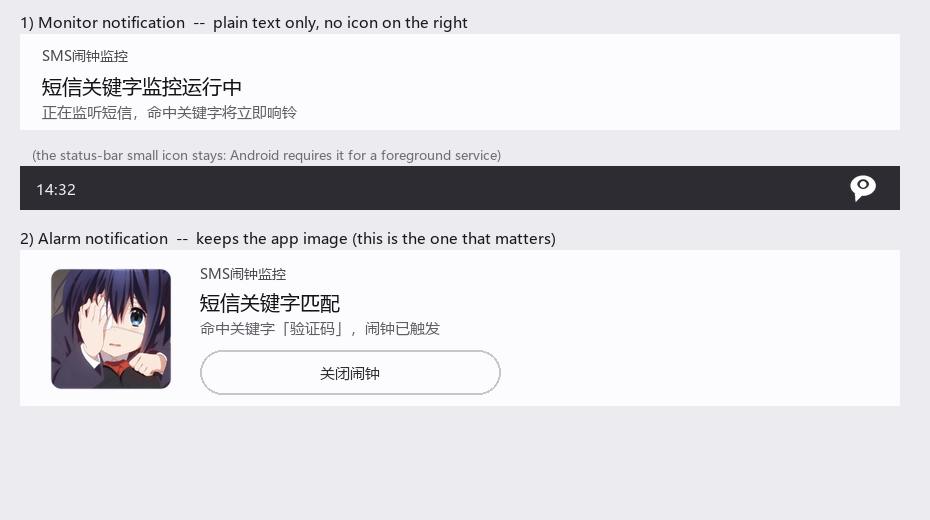

# SMS 闹钟监控（SMSmonitor）

> 收到含指定关键字的短信 → 立刻响闹钟；到点却没收到该短信 → 也响闹钟。

一个**纯本地**的 Android 短信关键字告警应用。不申请网络权限，不上传任何数据，没有账号、没有服务端。



---

## 目录

- [它解决什么问题](#它解决什么问题)
- [功能一览](#功能一览)
- [技术栈与构建环境](#技术栈与构建环境)
- [快速开始](#快速开始)
- [架构总览](#架构总览)
- [核心机制一：双通道短信捕获](#核心机制一双通道短信捕获)
- [核心机制二：四路兜底的定时检查](#核心机制二四路兜底的定时检查)
- [核心机制三：后台保活体系](#核心机制三后台保活体系)
- [闹钟播放链路](#闹钟播放链路)
- [权限清单](#权限清单)
- [数据存储](#数据存储)
- [目录结构](#目录结构)
- [常见改动入口](#常见改动入口)
- [改代码前的硬约束](#改代码前的硬约束)
- [给 AI 编程助手的上下文提示](#给-ai-编程助手的上下文提示)
- [测试](#测试)
- [已知限制与坑](#已知限制与坑)
- [隐私](#隐私)
- [许可证](#许可证)

---

## 它解决什么问题

典型的两个场景：

1. **值守告警** —— 服务器/业务系统通过短信下发告警，手机收到含"故障""告警"等关键字的短信时必须立刻响铃，不能因为静音或后台被杀而漏掉。
2. **到点确认** —— 每天 08:00 前必须收到"值班已就绪"的短信；如果到点还没收到，说明上游没动静，同样要响铃提醒。

这类需求在国产 ROM 上非常难做稳：系统会杀后台、拦截广播、丢弃闹钟。本项目的绝大部分复杂度都在**对抗这种不确定性**，而不是在界面或业务逻辑上。

---

## 功能一览

| 功能 | 说明 |
|---|---|
| 关键字监控 | 维护一组关键字，短信正文包含任意一个即触发 |
| 定时检查任务 | 每天指定时刻回看前 N 分钟，窗口内没有符合条件的短信就响铃 |
| 号码过滤 | 定时检查可选限定发件号码，留空表示任意号码 |
| 自定义铃声与音量 | 从系统闹钟铃声中选择，音量 0–100 |
| 测试闹钟 | 一键试听当前铃声配置 |
| 监控日志 | 记录**所有**监控到的短信（含未命中的）与每次定时检查结果，最多 200 条 |
| 失效自诊断 | 超过 30 小时没有检查记录时，任务卡片红字提示"任务可能已失效"，引导用户去查自启动与电池优化 |
| 双通道捕获 | 静态广播 + ContentObserver + 服务内动态广播 |
| 四路兜底 | 主闹钟 / 备用闹钟 / WorkManager 巡检 / 启动补检 |
| 权限自检面板 | 主页实时显示各项权限与服务状态，缺哪个就显示对应申请按钮 |
| 权限降级提示 | 只授予"接收短信"却拒绝"读取短信"时，明确标记为**降级运行**并说明哪条通道失效 |
| 永久拒绝引导 | 用户勾选"不再询问"后，按钮改为"去设置开权限"，点击直接跳系统设置页 |

---

## 技术栈与构建环境

| 项目 | 版本 |
|---|---|
| 语言 | Kotlin 2.2.10 |
| Android Gradle Plugin | 9.3.0 |
| Gradle | 9.5.0（Tencent 镜像分发） |
| JDK | **25**（由 `gradle/gradle-daemon-jvm.properties` 指定工具链，缺失时自动下载） |
| Compose BOM | 2026.02.01 |
| AndroidX WorkManager | 2.10.0 |
| Lifecycle / Activity Compose | 2.6.1 / 1.8.0 |
| Java 源码级别 | 11 |
| compileSdk / targetSdk / minSdk | 37 / 37 / 26（Android 8.0） |
| applicationId | `org.qingyingqx.smsmonitor` |

依赖仓库在 `settings.gradle.kts` 里换成了**阿里云镜像**，Gradle 发行包用的是**腾讯镜像**，都是为了在国内网络下能正常构建。

> ⚠️ **这是一套相当新的工具链。** 用老版本 Android Studio 打开会提示 AGP 不兼容。`app/build.gradle.kts` 里用的是 AGP 9 的新 DSL：
> ```kotlin
> compileSdk { version = release(37) }   // 不是 compileSdk = 37
> optimization { enable = false }        // 不是 isMinifyEnabled = false
> ```
> 另外插件块里**只有** `com.android.application` 和 `org.jetbrains.kotlin.plugin.compose`，没有传统模板里的 `kotlin-android`。不要照搬旧模板往里加插件。

---

## 快速开始

### 环境要求

- Android Studio（支持 AGP 9 的版本）
- JDK 25（Gradle 会按 `gradle-daemon-jvm.properties` 自动拉取）
- Android SDK Platform 37

### 构建

```bash
git clone https://github.com/qingying-0/SMSmonitor.git
cd SMSmonitor

# 1. 指定本机 SDK 路径（该文件已被 .gitignore 排除，不会入库）
#    Windows 示例：
#    sdk.dir=C\:\\Users\\<你>\\AppData\\Local\\Android\\Sdk
#    macOS/Linux 示例：
#    sdk.dir=/Users/<你>/Library/Android/sdk
echo "sdk.dir=<你的 SDK 路径>" > local.properties

# 2. 编译
./gradlew :app:assembleDebug          # Windows 用 gradlew.bat

# 3. 安装到已连接的设备
./gradlew :app:installDebug

# 4. 跑单元测试
./gradlew :app:testDebugUnitTest
```

> `local.properties` 是唯一必须手工创建的文件。**不要把它提交上去**——它含本机绝对路径。

### 首次运行必须做的事

装好后依次完成，否则功能不会生效：

1. 授予**短信权限**（`RECEIVE_SMS` + `READ_SMS`）
2. 授予**通知权限**（Android 13+）
3. 打开**精准闹钟**开关（部分 ROM 默认关闭）
4. 把应用加入**电池优化白名单**
5. 在系统设置里打开**自启动**（小米/HyperOS、华为、OPPO、vivo 等必需）

主页的「运行状态」卡片会逐项提示，缺哪项就点哪项。

---

## 架构总览

整个应用**没有使用 ViewModel、Repository、依赖注入或数据库**。所有逻辑通过 Kotlin `object` 单例 + 广播接收器 + 前台服务组织，状态存在 `SharedPreferences` 里。这样做的原因是：核心逻辑必须能在**广播接收器里被冷启动调用**，此时没有 Activity、没有生命周期，越简单越可靠。

```
                        ┌──────────────────────────────┐
   短信到达 ──────────▶ │  ① 静态广播 SmsReceiver       │──┐
                        ├──────────────────────────────┤  │
   短信到达 ──────────▶ │  ② 动态广播（服务内注册）      │──┤
                        ├──────────────────────────────┤  │
   content://sms 变化 ▶ │  ③ ContentObserver           │──┤
                        └──────────────────────────────┘  │
                                                          ▼
                                              ┌───────────────────────┐
                                              │  SmsTrigger.handle()  │
                                              │  ├ TriggerGate 去重    │
                                              │  ├ 关键字匹配          │
                                              │  └ 申请响铃许可        │
                                              └───────────┬───────────┘
                                                          ▼
                                    ┌─────────────────────────────────────┐
                                    │ AlarmScheduler（精准闹钟中转）        │
                                    │ → AlarmReceiver → AlarmService      │
                                    │ 失败则直接 AlarmService.start() 降级 │
                                    └─────────────────┬───────────────────┘
                                                      ▼
                                    ┌─────────────────────────────────────┐
                                    │ AlarmService（前台服务, mediaPlayback）│
                                    │ → AlarmPlayer（MediaPlayer 循环播放） │
                                    └─────────────────────────────────────┘
```

### 模块职责

| 文件 | 职责 |
|---|---|
| `MainActivity.kt` | 全部界面（Compose，约 1560 行）+ 权限申请 + 状态轮询 + 启动补检 |
| `Prefs.kt` | SharedPreferences 的**所有** key 常量，集中定义 |
| `SmsReceiver.kt` | 短信广播接收器，解析并拼接长短信 PDU，转交 `SmsTrigger` |
| `SmsTrigger.kt` | **短信处理主流程**：去重 → 匹配 → 响铃 → 记日志 |
| `TriggerGate.kt` | 跨通道去重（5 秒窗口）+ 响铃冷却（1 秒） |
| `SmsMonitorService.kt` | 监控前台服务：ContentObserver + 动态广播 + 常驻通知 |
| `CheckTask.kt` | 定时检查任务：`CheckTask` 数据类、`CheckTaskStore`、`TaskAlarmScheduler`、`SmsLookup`、`CheckRunner` |
| `TaskCheckReceiver.kt` | 定时检查闹钟接收器（主/备两道闹钟都投递到这里） |
| `AlarmScheduler.kt` | 精准闹钟中转，规避后台启动前台服务的限制 |
| `AlarmReceiver.kt` | 中转接收器，拿到前台服务白名单后拉起 `AlarmService` |
| `AlarmService.kt` | 闹钟前台服务，含 `AlarmReason` 枚举与降级播放 |
| `AlarmPlayer.kt` | `MediaPlayer` 单例，循环播放闹钟铃声，暴露 `StateFlow<Boolean>` |
| `AlarmLog.kt` | 日志模型（`TriggerChannel` / `AlarmOutcome`）与 JSON 持久化 |
| `Notifications.kt` | 通知渠道与两种通知的构建 |
| `BootReceiver.kt` | 开机/时间变化后恢复服务与重排闹钟 |
| `Watchdog.kt` | WorkManager 周期守护任务的管理（`sync` / `start` / `stop`） |
| `MonitorWorker.kt` | 15 分钟巡检：拉活服务 + 补检任务 |
| `ui/theme/` | Compose 主题（颜色以 `Ink*` 前缀命名） |

---

## 核心机制一：双通道短信捕获

系统收到短信时，应用有**三条**路径能感知到（前两条合称"双保险"）：

| # | 通道 | 载体 | 存活条件 | 日志标记 |
|---|---|---|---|---|
| ① | 静态广播 | `AndroidManifest` 注册的 `SmsReceiver`，`priority=1000` | 进程**被杀死也能**被系统拉起 | `BROADCAST` |
| ② | 动态广播 | `SmsMonitorService` 内 `registerReceiver` | 服务存活期间 | `BROADCAST` |
| ③ | ContentObserver | `SmsMonitorService` 监听 `content://sms` | 服务存活 + 有 `READ_SMS` 权限 | `CONTENT_OBSERVER` |

通道 ③ 是**唯一不依赖系统广播**的路径，专门用来兜底那些拦截了 `SMS_RECEIVED` 的 ROM。

### 三路去重

同一条短信会在 1 秒内被三条路径先后看到，因此 `TriggerGate` 做了两级控制：

```kotlin
// TriggerGate.kt
private const val DUPLICATE_WINDOW_MS = 5_000L   // 同一短信的去重窗口
private const val ALARM_COOLDOWN_MS   = 1_000L   // 两次响铃的最小间隔
```

- `register(body)` —— 按**正文哈希**去重。非首次见到直接返回，**既不记日志也不响铃**。
  > 指纹只取正文是有意为之：广播通道给的 `timestampMillis` / `originatingAddress` 与 Provider 里的 `date` / `address` 格式不一致，拿去当指纹会导致去重失效。代价是同一 5 秒窗口内两条**正文完全相同**的短信会被合并成一条。
- `acquireAlarmSlot()` —— 只做冷却，**不参与去重**。这样日志能如实记录每一条短信，而闹钟不会被反复重启。命中但处于冷却期时记为 `AlarmOutcome.SUPPRESSED`。

### ContentObserver 的游标推进

`SmsMonitorService` 用 `lastSeenId` 记住已处理的收件箱 `_id`，服务启动时先取当前最大值，避免把历史短信当成新短信补响一遍。查询时按 `_id > lastSeenId` 升序处理，**无论是否命中都推进游标**。

---

## 核心机制二：四路兜底的定时检查

定时检查的语义是：

> 每天 `hour:minute` 截止，回看前 `lookbackMinutes` 分钟。窗口内若没有正文含 `keyword` 的短信（`sender` 非空时还要求来自该号码），**或无法读取短信**，就响铃。

### 幂等锚点

整个机制建立在一个概念上——**最近一个已经过去的截止时刻**（`mostRecentDeadline`）：

```kotlin
// CheckRunner.runIfDue()
val deadline = TaskAlarmScheduler.mostRecentDeadline(task.hour, task.minute, now)
if (CheckTaskStore.lastCheckedDeadline(context) >= deadline) return false   // 幂等跳过
val since = deadline - task.lookbackMinutes * 60_000L
```

判定"该不该检查"**只依赖于这个截止时刻，与"实际在什么时刻被调用"完全无关**。因此下面四条互不相干的路径可以随意重复触发，同一天只会真正检查一次、只会响一次：

| # | 路径 | API / 机制 | 特点 |
|---|---|---|---|
| 1 | 主闹钟 | `AlarmManager.setAlarmClock()` | 精准、免于 Doze、**投递时附带前台服务启动白名单** |
| 2 | 备用闹钟 | `setExactAndAllowWhileIdle()` | 晚 3 分钟，用**另一个** AlarmManager API，对抗 OEM 差异化处理 |
| 3 | WorkManager | 15 分钟周期任务 | **另一套调度子系统**（JobScheduler），自带跨重启持久化 |
| 4 | 启动补检 | `MainActivity.checkPermissions()` | 应用一打开就补齐错过的截止时刻，**"强行停止"之后唯一的恢复路径** |

前三条都可能被系统或 OEM 静默掐掉，只要还有一条活着，最迟 15 分钟内就会补上。

> 备用闹钟用不同的 `requestCode`（`4001` / `4002`），避免互相覆盖。所有路径都记入同一份日志，**来源一栏**能直接看出是准点触发还是某条兜底路径补上的。

### 先落盘再响铃

```kotlin
// 先落盘"已完成"，再响铃：宁可极少数情况下漏响，
// 也不要四条路径同时响成一团
CheckTaskStore.saveLastCheckedDeadline(context, deadline)
```

### 时间计算必须用 Calendar

`nextTriggerAt` 和 `mostRecentDeadline` 都用 `Calendar` 而不是硬编码 86400000 毫秒，好让夏令时由系统历法处理。两者都接收 `now` 作为参数，**是为了能在 JVM 上直接单元测试**。

### 启用任务时防止"凭空响一次"

```kotlin
// CheckTaskStore.startFreshFromNow()
```

用户启用任务或修改时间时，把"当前已过去的那个截止时刻"直接标记为已处理。否则刚启用就会对今天早些时候那个早已错过的截止时刻触发补检，马上响一次。

### 号码归一化匹配

运营商下发的 `address` 与用户手输的号码经常不一致，`SmsLookup.addressMatches` 把两边各自归一化成候选集合再求交集：

```
"+86 138-0013-8000"  →  {8613800138000, 13800138000}
"013800138000"       →  {013800138000, 13800138000}
"13800138000"        →  {13800138000}
```

抽出所有数字后生成变体：原串、去掉前导 `0`、以及（仅当剩余长度 > 8 时）剥离 `86` 前缀。

**刻意不做"后缀包含"这类模糊匹配**——否则 `12345` 会被 `55512345` 误判为同一号码。非数字号码（如 `Bank-Alert`）退化为忽略大小写的全等匹配。

---

## 核心机制三：后台保活体系

项目**没有**使用任何第三方保活库，也没有双进程、无声音乐、一像素 Activity 那套做法。取而代之：

| 组件 | 机制 | 作用 |
|---|---|---|
| `SmsMonitorService` | 前台服务（`specialUse`）+ `START_STICKY` | 承载 ContentObserver；被杀后系统自动重建 |
| `MonitorWorker` | WorkManager 15 分钟周期（允许的最小值） | 服务死了就拉活；任务到点没检查就补检 |
| `BootReceiver` | `BOOT_COMPLETED` / `LOCKED_BOOT_COMPLETED` / `QUICKBOOT_POWERON` / `MY_PACKAGE_REPLACED` | 重启后恢复服务、重排闹钟 |
| `BootReceiver` | `TIME_SET` / `TIMEZONE_CHANGED` | 只需重排闹钟，不动服务 |
| `MainActivity.onResume` | 2 秒轮询 + 自愈 | 回到前台时重新拉起被 ROM 清理的服务 |

守护任务通过 `Watchdog.sync(context)` 统一管理——**只要"监控服务"或"定时检查任务"任一启用就需要它**。不要直接调用 `Watchdog.start()` / `stop()`，否则状态会不一致。

```kotlin
val monitoring  = prefs.getBoolean(Prefs.KEY_MONITORING_ENABLED, false)
val taskEnabled = CheckTaskStore.load(context).enabled
if (monitoring || taskEnabled) start(context) else stop(context)
```

> WorkManager 用 `ExistingPeriodicWorkPolicy.KEEP` 入队，重复调用不会重置周期。

### 完整关闭监控

用户点"停止监控"时**必须**走 `SmsMonitorService.shutdown()`，缺任何一步都会导致"停止"被自愈逻辑撤销：

```kotlin
fun shutdown(context: Context) {
    prefs.edit().putBoolean(Prefs.KEY_MONITORING_ENABLED, false).apply()  // 1. 清总开关
    AlarmScheduler.cancel(context)                                        // 2. 撤中转闹钟
    AlarmService.stop(context)                                            // 3. 停闹钟
    Watchdog.sync(context)                                                // 4. 重新评估守护去留
    stop(context)                                                         // 5. 停服务
}
```

通知栏的"停止监控"按钮也走同一条路径（通过 `ACTION_STOP`）。

---

## 闹钟播放链路

### 为什么必须绕一圈用精准闹钟中转

Android 12+ 禁止后台应用直接启动前台服务。从短信广播里直接 `startForegroundService()` 会抛 `ForegroundServiceStartNotAllowedException`。

而通过 `AlarmManager` 精准闹钟投递 `PendingIntent` 时，**系统会授予应用一个 `FOREGROUND_SERVICE_ALLOWED` 类型的临时白名单**，此时启动前台服务是被明确允许的——这正是闹钟类应用的合法路径。

```
SmsReceiver → SmsTrigger → AlarmScheduler.schedule()
                              ↓ setAlarmClock(now + 50ms)
                          AlarmReceiver
                              ↓ 此时已获得白名单
                          AlarmService.start()  → AlarmPlayer.play()
```

白名单是在**闹钟投递时**授予的，与延迟长短无关，所以 `DELAY_MS = 50L` 只留了极短的调度余量。中转不可用时（`canScheduleExact` 为 false）自动降级为直接启动。

### 为什么要用前台服务播放

若直接在 `BroadcastReceiver` 里播放，`onReceive()` 返回后进程没有活跃组件，系统会在数秒内回收进程，**闹钟刚响就哑掉**。所以 `AlarmService` 先 `startForeground()` 建立 `mediaPlayback` 类型的前台服务，再交给 `AlarmPlayer` 循环播放。

### 音频通道

`AlarmPlayer.createPlayer()` 使用：

```kotlin
AudioAttributes.USAGE_ALARM + CONTENT_TYPE_SONIFICATION
```

`USAGE_ALARM` 走的是**闹钟音量通道**而非媒体通道，这是它能盖过静音/媒体音量为 0 的原因。`MediaPlayer` 设为 `isLooping = true` 持续播放，直到用户点通知里的"关闭闹钟"（`AlarmDismissReceiver`）或界面上的停止按钮。

铃声来源由 `RingtonePickerDialog` 从 `RingtoneManager.TYPE_ALARM` 枚举；播放失败会回退到系统默认闹钟铃声。

### 闹钟触发原因

`AlarmReason` 枚举决定通知文案，也便于排查"这次为什么响"：

| 值 | 含义 |
|---|---|
| `SMS_KEYWORD` | 短信命中关键字 |
| `TASK_MISSING` | 定时检查：窗口内未收到符合条件的短信 |
| `TASK_UNVERIFIABLE` | 定时检查：无法读取短信，按未收到处理 |
| `TEST` | 用户手动测试 |

---

## 权限清单

| 权限 | 用途 | 备注 |
|---|---|---|
| `RECEIVE_SMS` | 接收短信广播 | 运行时申请 |
| `READ_SMS` | ContentObserver 与收件箱回查 | 运行时申请 |
| `POST_NOTIFICATIONS` | 前台服务通知与闹钟通知 | Android 13+ |
| `FOREGROUND_SERVICE` | 前台服务基础权限 | 普通权限 |
| `FOREGROUND_SERVICE_SPECIAL_USE` | 监控服务的类型 | 配合 `PROPERTY_SPECIAL_USE_FGS_SUBTYPE` |
| `FOREGROUND_SERVICE_MEDIA_PLAYBACK` | 闹钟服务的类型 | |
| `RECEIVE_BOOT_COMPLETED` | 开机自启恢复监控 | |
| `SCHEDULE_EXACT_ALARM` | 精准闹钟 | 仅 `maxSdkVersion="32"` |
| `USE_EXACT_ALARM` | 精准闹钟 | Android 13+ 免授权，本应用核心功能即"创建闹钟"，用途正当 |
| `REQUEST_IGNORE_BATTERY_OPTIMIZATIONS` | 引导加入电池优化白名单 | |

> **本应用不申请 `INTERNET` 权限。** 这是刻意的，也是它隐私承诺的技术基础——没有网络权限，数据在物理上就无法外传。**引入任何需要联网的依赖前请三思**。

### 短信权限是三态，不是布尔值

`RECEIVE_SMS` 和 `READ_SMS` 是两个**独立**权限，可以被单独授予。所以 `SmsPermission` 是枚举而非 `Boolean`：

| 状态 | 含义 | 界面表现 |
|---|---|---|
| `FULL` | 两条权限都拿到 | 绿灯「已就绪」 |
| `RECEIVE_ONLY` | 只有接收权限 | **黄灯「降级运行」** + 说明"缺少「读取短信」权限，ContentObserver 兜底通道未生效" |
| `NONE` | 两条都没有 | 红灯「未就绪」 |

`RECEIVE_ONLY` 是最容易被忽略的状态：应用**看起来一切正常**，广播通道（①②）也照常工作，但那条唯一不依赖系统广播的兜底通道（③）已经静默失效了——而这恰恰是它存在的理由。因此这个中间态必须显式暴露给用户，不能显示成"已就绪"。

状态灯因此也是三级的（`StatusLevel`），而不是原来的"就绪/未就绪"二选一。

### 权限被永久拒绝后的引导

用户勾选"不再询问"后，再调用系统权限弹窗**不会有任何反应**（既不弹窗也不报错），按钮会变成看起来坏掉的死按钮。

判定逻辑：`shouldShowRequestPermissionRationale()` 在"**从未申请过**"和"**已被永久拒绝**"两种情况下**都**返回 `false`，单靠它无法区分。因此额外用 `Prefs.KEY_PERM_SMS_ASKED` / `KEY_PERM_NOTIFICATION_ASKED` 持久化"是否已经弹过申请框"，只有三者同时成立才认定为永久拒绝：

```
已申请过  &&  仍未授予  &&  系统不再愿意展示理由
```

此时按钮文案改为「去设置开权限」，点击直接跳转应用详情页。

---

## 数据存储

全部数据放在 `SharedPreferences`（文件 `sms_monitor_prefs`），**没有数据库**。所有 key 集中在 `Prefs.kt`。

| Key | 类型 | 默认值 | 含义 |
|---|---|---|---|
| `keywords` | `StringSet` | 空集 | 关键字集合 |
| `volume` | `Int` | `80` | 音量百分比 |
| `ringtone_uri` / `ringtone_name` | `String` | 系统默认闹钟 | 铃声 |
| `monitoring_enabled` | `Bool` | `false` | 监控总开关 |
| `alarm_logs` | `String` | — | 日志 JSON 数组，最多 200 条 |
| `task_enabled` | `Bool` | `false` | 定时检查开关 |
| `task_hour` / `task_minute` | `Int` | `8` / `0` | 截止时刻 |
| `task_lookback` | `Int` | `30` | 回看分钟数（1 ~ 1440） |
| `task_sender` | `String` | `""` | 限定号码，空 = 任意 |
| `task_keyword` | `String` | `""` | 指定关键字（**必填**） |
| `task_last_at` / `task_last_outcome` / `task_last_hits` | `Long`/`String`/`Int` | — | 上次检查结果，供主页展示 |
| `task_last_deadline` | `Long` | `0` | **已完成的最近截止时刻，幂等判定的锚点** |
| `perm_sms_asked` / `perm_notification_asked` | `Bool` | `false` | 是否已弹过权限申请框，用于判定"永久拒绝" |

日志用 `org.json` 手工序列化（`AlarmLog.kt`），**没有引入任何新依赖**。`parseOutcome()` 保留了旧版本仅有 `matched` / `started` 字段的兼容逻辑。

`AlarmLogEntry.matched` 的定义有个容易踩的点：**定时检查条目不计入"命中"统计**（`!isTaskCheck && outcome != NOT_MATCHED`）。

---

## 目录结构

```
SMSmonitor/
├── app/
│   ├── src/main/
│   │   ├── AndroidManifest.xml          # 权限、组件、广播优先级
│   │   ├── java/org/qingyingqx/smsmonitor/
│   │   │   ├── MainActivity.kt          # 全部 Compose UI + 权限 + 补检
│   │   │   ├── Prefs.kt                 # SharedPreferences key 常量
│   │   │   ├── SmsReceiver.kt           # ① 静态广播
│   │   │   ├── SmsTrigger.kt            # 短信处理主流程
│   │   │   ├── TriggerGate.kt           # 去重 + 冷却
│   │   │   ├── SmsMonitorService.kt     # ②③ 前台服务
│   │   │   ├── CheckTask.kt             # 定时检查（模型/存储/排程/查询/执行）
│   │   │   ├── TaskCheckReceiver.kt     # 定时检查闹钟接收器
│   │   │   ├── AlarmScheduler.kt        # 精准闹钟中转
│   │   │   ├── AlarmReceiver.kt         # 中转接收器
│   │   │   ├── AlarmService.kt          # 闹钟前台服务
│   │   │   ├── AlarmPlayer.kt           # MediaPlayer 单例
│   │   │   ├── AlarmLog.kt              # 日志模型 + JSON 持久化
│   │   │   ├── Notifications.kt         # 通知渠道与构建
│   │   │   ├── BootReceiver.kt          # 开机/时间变化
│   │   │   ├── Watchdog.kt              # 守护任务调度
│   │   │   ├── MonitorWorker.kt         # 15 分钟巡检
│   │   │   └── ui/theme/                # Compose 主题
│   │   ├── keepRules/rules.keep         # R8 keep 规则（当前为空模板）
│   │   └── res/                         # 图标、字符串、备份规则
│   ├── src/test/                        # JVM 单元测试
│   ├── src/androidTest/                 # 仪器测试（模板）
│   └── build.gradle.kts
├── gradle/
│   ├── libs.versions.toml               # 版本目录（改依赖版本看这里）
│   ├── gradle-daemon-jvm.properties     # JDK 25 工具链
│   └── wrapper/                         # Gradle 9.5（腾讯镜像）
├── app_icon_preview.png                 # 通知效果预览图
├── build.gradle.kts
├── settings.gradle.kts                  # 阿里云 Maven 镜像
└── local.properties                     # ❌ 不入库
```

---

## 常见改动入口

| 想改什么 | 去哪里 |
|---|---|
| 短信命中后的处理流程 | `SmsTrigger.handle()` |
| 去重窗口 / 响铃冷却时长 | `TriggerGate` 顶部的两个常量 |
| 关键字匹配规则（如正则、大小写） | `SmsTrigger.handle()` 中 `keywords.firstOrNull { body.contains(it) }` |
| 定时检查的判定逻辑 | `CheckRunner.runIfDue()` |
| 回看窗口的计算 | `CheckTask.kt` 中 `since = deadline - task.lookbackMinutes * 60_000L` |
| 号码匹配规则 | `SmsLookup.addressMatches()` / `numberVariants()` |
| 下次触发时刻的计算 | `TaskAlarmScheduler.nextTriggerAt()` / `mostRecentDeadline()` |
| 闹钟声音 / 循环 / 音频通道 | `AlarmPlayer.createPlayer()` |
| 闹钟通知文案 | `Notifications.buildAlarmNotification()` 的 `when (reason)` |
| 后台保活策略 | `Watchdog`（周期）与 `MonitorWorker.doWork()`（巡检内容） |
| 日志条数上限 / 正文长度 | `AlarmLog` 的 `MAX_ENTRIES` / `BODY_MAX_LEN` |
| "任务已失效"的判定时长 | `MainActivity.kt` 顶部的 `STALE_AFTER_MS`（默认 30 小时） |
| 回看时长的可选范围 | `CheckTaskDialog` 里 `Slider` 的 `valueRange`（当前 5–240 分钟，与存储层 1–1440 的钳制范围不同） |
| 短信权限的三态判定 | `resolveSmsPermission()`（纯函数，有单测）与 `SmsPermission` 枚举 |
| 状态灯的颜色与文案 | `statusColor()` / `statusText()`，以及 `StatusLevel` 枚举 |
| 权限永久拒绝的判定 | `isPermanentlyDenied()` |
| 界面卡片顺序 | `HomePage()` 里那个 `Column` 的子项顺序 |
| 界面配色 | `ui/theme/Color.kt`（`Ink*` 前缀）与 `channelColor()` / `outcomeColor()` / `statusColor()` |
| 日志筛选分类 | `LogFilter` 枚举（`ALL` / `SMS` / `TASK`） |
| 依赖版本 | `gradle/libs.versions.toml` |

界面结构（`HomePage` 内的卡片顺序）：标题 → 响铃提醒（仅响铃时）→ 运行状态 → 权限申请按钮 → 关键字 → 闹钟参数 → 启用/测试按钮 → 定时检查 → 监控日志 → 后台保活引导 → 隐私声明。

---

## 改代码前的硬约束

> 这一节是给**人和 AI** 看的。下面每一条都对应一个真实的失败模式，改错了会在真机上表现为"偶尔不响"——最难排查的一类 bug。

1. **不要在 `SmsReceiver` / `SmsTrigger` 里直接 `startForegroundService()`。**
   Android 12+ 会抛 `ForegroundServiceStartNotAllowedException`。必须经 `AlarmScheduler.schedule()` 中转，或准备好降级路径。

2. **不要移除 `TriggerGate.register()` 的去重。**
   三条捕获路径必然重复上报同一条短信，去掉就会响三次。

3. **不要改变 `CheckRunner.runIfDue()` 的幂等语义。**
   `lastCheckedDeadline` 必须**先落盘再响铃**。顺序反了会导致四条路径并发时响成一团。

4. **`nextTriggerAt` 与 `mostRecentDeadline` 必须成对演变。**
   它们是"排下一次"和"补检锚点"的两端，必须严格对齐（`nextTrigger` 恰好比 `mostRecentDeadline` 晚一天）。`CheckTaskLogicTest` 专门锁定了这个关系。

5. **新增 `TriggerChannel` / `AlarmOutcome` 枚举值必须同时给 `label`。**
   有测试 (`everyChannelAndOutcomeHasALabel`) 兜底——否则日志弹窗会出现空白徽标。

6. **`SmsMonitorService.isRunning` 只在主进程内有效。**
   它是进程内 `@Volatile` 静态标志，进程被杀后自然为 `false`。Worker 运行在主进程所以这个判断是准确的，**不要引入第二个进程**。

7. **新增 SharedPreferences key 请加到 `Prefs.kt`。**
   不要在各处硬编码字符串。

8. **前台服务类型必须与 `AndroidManifest` 一致。**
   `SmsMonitorService` → `specialUse`，`AlarmService` → `mediaPlayback`。Android 14+ 不匹配会直接崩溃。

9. **不要申请 `INTERNET` 权限，不要引入网络依赖。**
   这是隐私承诺的基础。

10. **不要把 `local.properties` 提交上去。**

11. **时间计算一律用 `Calendar`，不要硬编码毫秒数**，并且把 `now` 作为参数传入以保持可测试性。

12. **不要把 `SmsPermission` 简化回 `Boolean`。**
    `READ_SMS` 被单独拒绝时，兜底通道会静默失效，而界面看起来一切正常。三态是有意设计，`SmsPermissionTest` 锁定了它。

13. **权限判定要区分"从未申请"和"已被永久拒绝"。**
    两者在 `shouldShowRequestPermissionRationale()` 上表现相同，必须结合 `Prefs.KEY_PERM_*_ASKED` 才能区分，否则永远走不到"去设置开权限"这条路径。

---

## 给 AI 编程助手的上下文提示

如果你打算用 Claude Code / Cursor / Copilot 等工具改这个项目，建议先把下面这段喂给它：

```text
项目：SMSmonitor，一个纯本地 Android 短信关键字告警应用。
技术栈：Kotlin 2.2.10 + Jetpack Compose（Material3）+ AGP 9.3.0 + Gradle 9.5 + JDK 25，
       minSdk 26 / targetSdk 37，无 ViewModel / 无 DI / 无数据库。

架构要点：
- 全部状态存 SharedPreferences（常量集中在 Prefs.kt），通过 kotlin object 单例访问。
- 短信捕获有三条路径：静态广播（进程被杀也能拉起）、服务内动态广播、ContentObserver。
  三者都会看到同一条短信，靠 TriggerGate 按正文哈希做 5 秒去重；响铃另有 1 秒冷却。
- 所有路径统一调用 SmsTrigger.handle()，不要绕过它直接响铃。
- 响铃必须经 AlarmScheduler 精准闹钟中转（Android 12+ 后台启动前台服务限制），
  失败时降级为 AlarmService.start()。绝不能在 BroadcastReceiver 里直接 startForegroundService。
- 定时检查任务用「最近一个已过去的截止时刻」作为幂等锚点（CheckRunner.runIfDue），
  四条路径（主闹钟/备用闹钟/WorkManager 巡检/启动补检）重复触发只会响一次。
- 界面全在 MainActivity.kt（约 1560 行，Compose 函数式组件，无 ViewModel）。

修改时必须遵守：
1. 不要破坏 TriggerGate 去重与 CheckRunner 幂等（先落盘再响铃）。
2. nextTriggerAt 与 mostRecentDeadline 必须成对修改，并跑 CheckTaskLogicTest。
3. 新增 TriggerChannel / AlarmOutcome 枚举值要给 label 文案。
4. 不要申请 INTERNET 权限或引入网络依赖。
5. 时间计算用 Calendar 且把 now 作为参数传入（为了可测）。
6. 改完至少跑 ./gradlew :app:assembleDebug 与 :app:testDebugUnitTest。
```

---

## 测试

```bash
./gradlew :app:testDebugUnitTest
```

`app/src/test/.../CheckTaskLogicTest.kt` 是**纯 JVM 单测**（不依赖 Android 运行时），覆盖三块关键逻辑：

- **下一次触发时刻**：今天/明天/恰好到点/晚 1 毫秒，以及"结果必须严格晚于当前时刻"
- **最近截止时刻**：作为补检锚点，以及"结果不得晚于当前时刻"
- **号码归一化匹配**：区号前缀、前导 0、空格与连字符、短号、非数字号码、以及"后缀不算同一号码"
- **配置校验与日志语义**：`configComplete` 只要求关键字、`senderText` 回退、时间补零、定时检查不计入命中数

要用好这套单测，**保持 `TaskAlarmScheduler` 和 `SmsLookup` 里的函数是纯函数**（不碰 Android API）是关键。

`app/src/test/.../SmsPermissionTest.kt` 是第二个纯 JVM 单测，固定 **`resolveSmsPermission()` 的四种授予组合**——尤其锁定"只有接收权限 → `RECEIVE_ONLY`"这条，防止以后有人把它简化回 Boolean，重新引入"兜底通道静默失效却显示已就绪"的问题。

当前共 **31 项测试**，全部通过：

```bash
./gradlew :app:testDebugUnitTest
# CheckTaskLogicTest   25 项
# SmsPermissionTest     5 项
# ExampleUnitTest       1 项（模板自带）
```

`app/src/androidTest/` 下只有模板生成的 `ExampleInstrumentedTest`。

---

## 已知限制与坑

- **国产 ROM 必须手工配置。** 电池优化白名单 + 自启动是必需的，应用只能引导，无法代劳。
- **"强行停止"之后一切自动机制都失效**，直到用户再次手动打开应用。这是 Android 的设计，无法绕过——所以第 4 条"启动补检"路径很重要。
- **去重指纹只取正文**，同一 5 秒窗口内两条正文完全相同的短信会被合并成一条。
- **日志只保留 200 条**，超出丢弃最旧的，且存在 `SharedPreferences` 里（不做大数据量设计）。
- **`SCHEDULE_EXACT_ALARM` 在部分 ROM 上默认关闭**，此时定时检查降级为"仅依赖 15 分钟兜底巡检"，最多晚 15 分钟。界面会提示。
- **`UNVERIFIABLE`（读不到短信）按"未收到"处理**——宁可误报不可漏报。如果你更在意误报，需要改 `CheckRunner` 里 `outcome != CheckOutcome.FOUND` 这个判断。
- **只有浅色主题。** `SMSmonitorTheme` 基于 `InkLightColorScheme`，没有深色模式分支。
- **应用只有一个 Activity、没有导航**，所有界面是同一个滚动页 + 三个 Dialog。

---

## 隐私

> 本应用不申请任何网络权限。所有数据仅保存在本机，不会上传至任何服务器。

这一点在技术上是可验证的：`AndroidManifest.xml` 中没有任何网络权限，代码里也没有网络请求。短信内容、关键字、日志全部留在设备的 `SharedPreferences` 里。

---

## 许可证

本项目尚未声明开源许可证。在添加许可证之前，默认保留所有权利。
